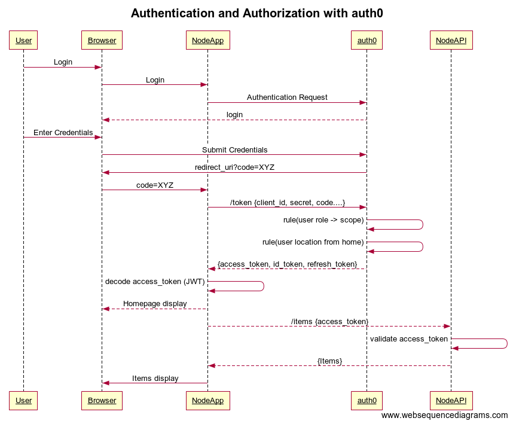

# auth0-sample

This is a sample application that demos the usage of scopes for access control with auth0. It also showcase the usage of rules for access control and profile enchancement.



As shown in the sequence diagram above, this sample has two components

1. Frontend web app (Node.js, Express, Jade, JQuery)
2. Backend API (Node.js, Express)

The frontend web app is used by users to login and add/delete/view the inventory of smart home devices. The frontend web app uses the backend API to store and retrieve this information. The frontend application is configured to use Auth0 for user authentication/authorization. Once a user is authenticated auth0 issues a set of tokens.

1. Access Token (Auth0 will issue a JWT if audience parameter is set in /authorize call https://auth0.com/docs/tokens/access-token)
2. Refresh Token (Auth0 will issue one once the Allow Offline Access is turned on https://auth0.com/docs/tokens/refresh-token/current)
3. id Token (https://auth0.com/docs/tokens/id-token)

In this flow, custom behavior is injected by using Auth0 rules.

##Scopes
OIDC scopes like openid, profile, email are used in this application to retrieve user profile information. The fine grain access control needed to read, write, delete application data is controlled by items:read, items:write, items:delete scopes.

These scopes are configured at the API level as custom scopes. The mapping of these scopes for a given user is done retrieving the user's app_metadata and figuring out the role of the user. Using the below mapping the token issued is updated with the appropriate scope.

* Admin: items:read, items:write, items:delete
* Adult: items:read, items:write
* Child: items:read

##Rules
A rule is a custom code that gets executed in the authentication/authorization flow, as shown in the sequence below. Rules are written in Node.js, there are a set of helper modules that are available for rules https://auth0.com/docs/appliance/modules.

In this sample two custom rules are utilized
1. Privileges: This rule is used to assign a scope by looking at the role of the user. When the rule executes the user's app meta data is retrieved and depending on the role specified the Access Token scopes are updated with one or more of these scopes.

2. Login-Location: This rule is used to enhance the user profile. By retrieving the current login location (Auth0 gives that information for all logins) and comparing with the User's home coordinates this rules finds the distance between the two and adds the same to the user's token.

## Configure Auth0

Here are the steps involved in configuring Auth0 Application and API for custom

* Log into Auth0
* Got to Dashboard https://manage.auth0.com/#/
* Create an Application
  * Select the kind of application, for this example it should be "Regular Web Application"
  * Click on Create Application
  * Once you Create the Application you will see the application credentials Client ID and Client Secret
  * Update the Application settings as per your needs
    * Add http://localhost:3000/callback to allowed callbacks
 
Now you have an application that can be used in conjunction with OIDC scopes (openid, profile, email). This example also needs further granular scopes to make access control decissions for that
 
* Create an API
  * Switch on "Allow Offline Access" for Refresh Token flow
  * In the scopes section create items:read, items:write, items:delete scopes
  
* Setting up User
  * Create a user in Auth0
  * Update user's meta_data with user's home location
  ```
  {
    "homeGeoIP": {
      "latitude": XXXXXXX,
      "longitude": XXXXXXX
    }
  }
  ```
  * Update user's app_metadata with user's role
  ```
  {
    "role": "admin/adult/child"
  }
  ```
  ## Installtion 
  
Download code from the repo. For setting up the backend API
  
  ```
  cd api
  npm install
  node server.js
  ```
  
  For setting up the frontend API
  
  ```
  cd www
  npm install
  node server.js
  ```
  
  
  

  
 

